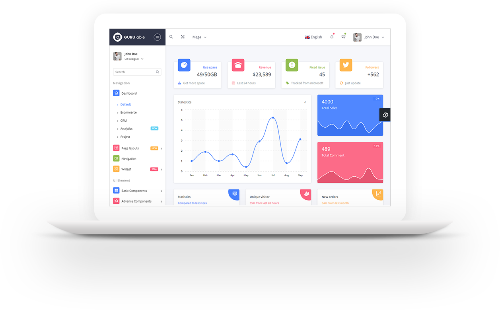

<h1>Cara Menggunakan :</h1>
<ul>
    <li>
1. Ketikan di Git Bash/CMD/Terminal <code>git clone https://github.com/arifpujinugroho/laravelgurutemplate.git</code>
</li>
    <li>
2. Masuk ke laravel template / laravelgurutemplate
</li>
    <li>
3. Duplikat .env.example
</li>
    <li>
3. Namakan kembali file duplikat tersebut menjadi .env
</li>
    <li>
4. Ketikan<code>composer install</code>
</li>
    <li>
5. Ketikan<code>php artisan key:generate</code>
</li>
    <li>
6. jika ingin melihat template didalam folder sesebut terdapat index.html
</li>
    <li>
7. atau jika ingin asset master dan sudah dipisah atau sudah melekat di laravel maka ketikan <code>php artisan serve</code>
</li>
    <li>
8. Jika sudah selesai code silakan hapus index.html, folder bower_components, dan folder default, serta folder assets
</li>
</ul>

<h2>Gambar Screnshoot :</h2>

